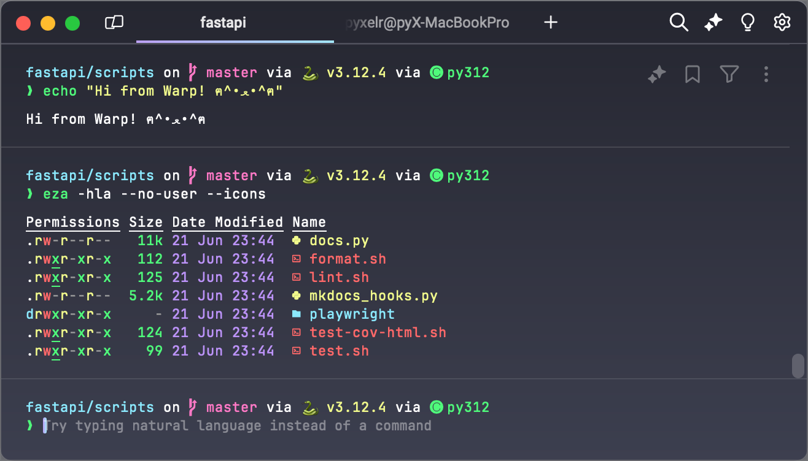
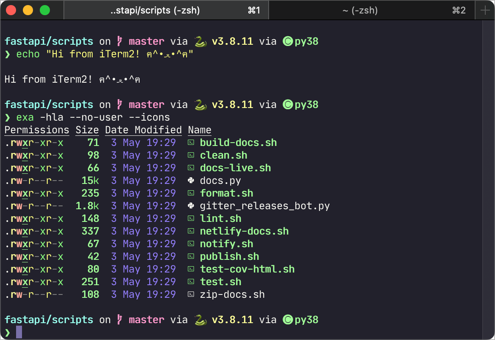
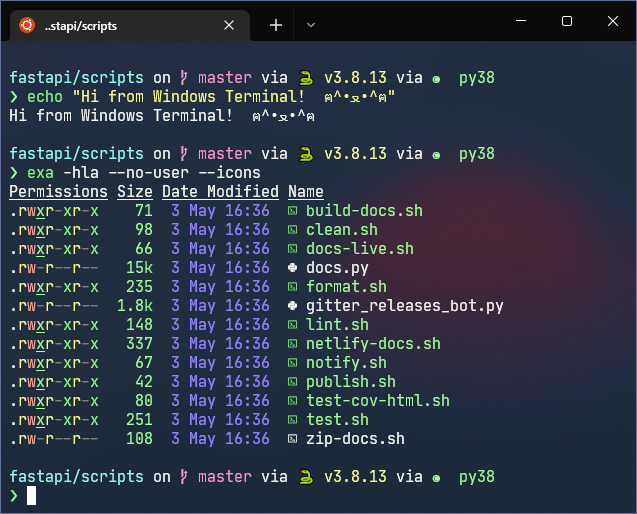
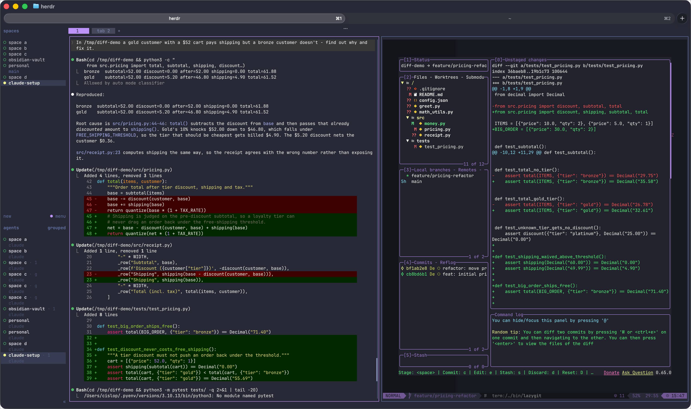
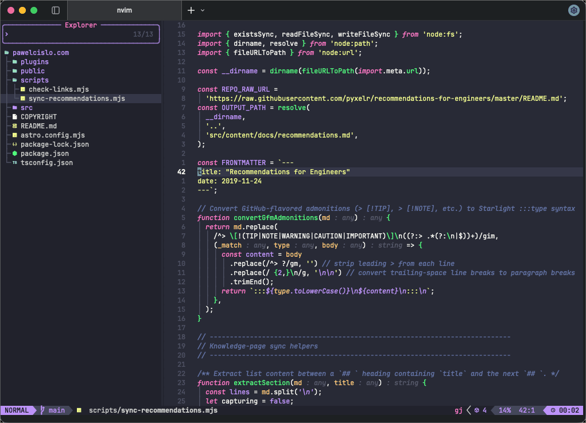
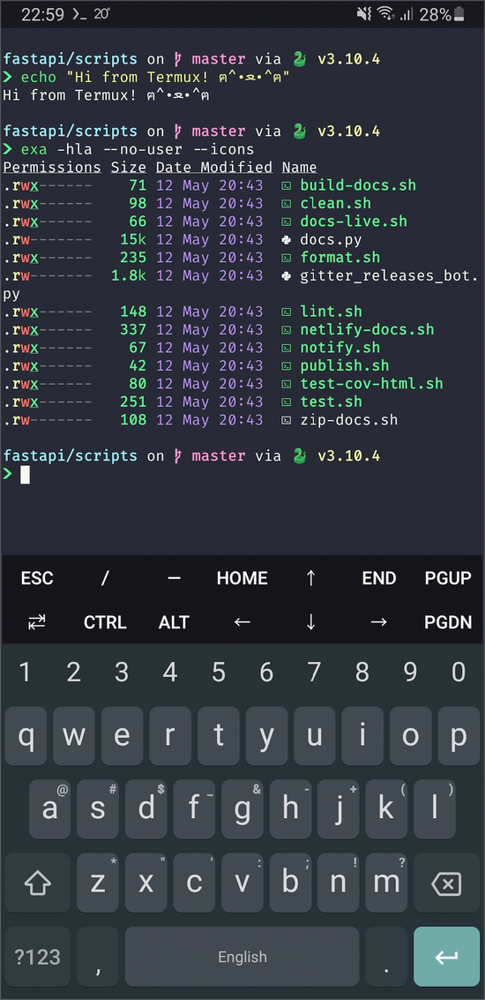

# My Terminal

The applied terminal varies by the host OS:

- [🍎 Warp](#-warp)
  - [🎨 Appearance](#-appearance)
  - [⚙️ Zsh settings](#%EF%B8%8F-zsh-settings)
    - [Plugins](#plugins)
    - [Shell aliases](#shell-aliases)
    - [Shell tools](#shell-tools)
- [🍎 iTerm2](#-iterm2)
  - [🎨 Appearance](#-appearance-1)
  - [✨ Extras](#-extras)
- [🖥 Windows Terminal](#-windows-terminal)
  - [🎨 Appearance](#-appearance-2)
  - [⚙️ Profiles](#%EF%B8%8F-profiles)
    - [Command Prompt](#command-prompt)
    - [Git Bash](#git-bash)
    - [PowerShell 7](#powershell-7)
    - [WSL - Ubuntu 22.04 (LTS)](#wsl---ubuntu-2204-lts)
- [🐑 herdr](#-herdr)
  - [🎨 Appearance](#-appearance-3)
  - [⚙️ Setup](#%EF%B8%8F-setup)
- [🐧 Neovim](#-neovim)
  - [🎨 Appearance](#-appearance-4)
  - [⚙️ Setup](#%EF%B8%8F-setup-1)
- [🤖 Termux](#-termux)
  - [🎨 Appearance](#-appearance-5)
  - [⚙️ Setup](#%EF%B8%8F-setup-2)

Additionally, I have included my herdr (agent multiplexer) and NeoVim (text editor) configs, which are both OS agnostic.

This repo only does not list my IDE: [VS Code settings](https://gist.github.com/pyxelr/760dac032d0427377ecc1bb195499d9b).

## 🍎 Warp

[Warp](https://www.warp.dev/) - my main terminal for macOS.

### 🎨 Appearance



- Theme: `Fancy Dracula`
- Prompt: `Shell prompt (PS1)`
- Font: [JetBrains Mono](https://github.com/JetBrains/JetBrainsMono) 11

### ⚙️ Zsh settings

- Framework: [Oh My Zsh](https://ohmyz.sh/)
- Prompt: [Starship](https://starship.rs/)
  - If you have installed conda, I suggest to disable printing environment names, as they will be displayed already by Starship: `conda config --set changeps1 False`

#### Plugins

Oh My Zsh plugins:

- [aws](https://github.com/ohmyzsh/ohmyzsh/tree/master/plugins/aws)
- [colored-man-pages](https://github.com/ohmyzsh/ohmyzsh/tree/master/plugins/colored-man-pages)
- [copyfile](https://github.com/ohmyzsh/ohmyzsh/tree/master/plugins/copyfile)
- [copypath](https://github.com/ohmyzsh/ohmyzsh/tree/master/plugins/copypath)
- [docker](https://github.com/ohmyzsh/ohmyzsh/tree/master/plugins/docker)
- [docker-compose](https://github.com/ohmyzsh/ohmyzsh/tree/master/plugins/docker-compose)
- [dotenv](https://github.com/ohmyzsh/ohmyzsh/tree/master/plugins/dotenv)
- [fzf](https://github.com/ohmyzsh/ohmyzsh/tree/master/plugins/fzf)
- [git](https://github.com/ohmyzsh/ohmyzsh/tree/master/plugins/git)
- [globalias](https://github.com/ohmyzsh/ohmyzsh/tree/master/plugins/globalias)
- [helm](https://github.com/ohmyzsh/ohmyzsh/tree/master/plugins/helm)
- [istioctl](https://github.com/ohmyzsh/ohmyzsh/tree/master/plugins/istioctl)
- [jsontools](https://github.com/ohmyzsh/ohmyzsh/tree/master/plugins/jsontools)
- [kubectl](https://github.com/ohmyzsh/ohmyzsh/tree/master/plugins/kubectl)
- [pip](https://github.com/ohmyzsh/ohmyzsh/tree/master/plugins/pip)
- [poetry](https://github.com/ohmyzsh/ohmyzsh/tree/master/plugins/poetry)
- [python](https://github.com/ohmyzsh/ohmyzsh/tree/master/plugins/python)
- [sudo](https://github.com/ohmyzsh/ohmyzsh/tree/master/plugins/sudo)
- [terraform](https://github.com/ohmyzsh/ohmyzsh/tree/master/plugins/terraform)
- [virtualenv](https://github.com/ohmyzsh/ohmyzsh/tree/master/plugins/virtualenv)
- [vscode](https://github.com/ohmyzsh/ohmyzsh/tree/master/plugins/vscode)

External plugins:

- [zsh-autosuggestions](https://github.com/zsh-users/zsh-autosuggestions) ← fish-like autosuggestions for Zsh
- [zsh-syntax-highlighting](https://github.com/zsh-users/zsh-syntax-highlighting) ← fish shell like syntax highlighting for Zsh

#### Shell aliases

> [!NOTE]  
> _Since 2024/01/07, I keep my core text-expansion config in [my-espanso-config](https://github.com/pyxelr/my-espanso-config)._

I recommend keeping aliases in the `~/.aliases` file, and then source this file in your respective profile file through `source ~/.aliases`. Keep in mind that a bunch of aliases is already configured through the aforementioned Oh My Zsh plugins, which you can quickly check using the [aliases](https://github.com/ohmyzsh/ohmyzsh/tree/master/plugins/aliases) plugin.

**general**:

- `alias aliases='code ~/.aliases'` ← quickly open `~/.aliases` in VS Code
- `alias lisl='eza -hla --icons'` ← better `ls` with [eza](https://github.com/eza-community/eza)
- `alias list='eza -hlas time --icons'` ← better `ls` with [eza](https://github.com/eza-community/eza) (ordered by time)
- `alias treee='br -c :pt'` ← better `tree` with [broot](https://github.com/Canop/broot)
- `alias path='echo -e ${PATH//:/\\n}'` ← show all directories in the PATH variable, one per line
- `alias ports='netstat -a | grep -i "listen"'` ← show all open ports and the processes using them
- `alias reload='source ~/.zshrc'` ← reload the configuration file for zsh
- `alias zshrc='code ~/.zshrc'` ← quickly open `~/.zshrc` in VS Code

**kubernetes**:

- `alias k8s-get-pods='kubectl get pods --all-namespaces'` ← get the list of all pods
- `alias k8s-get-services='kubectl get services --all-namespaces'` ← get the list of all services

**macOS**:
- `alias cleanup="find . -type f -name '*.DS_Store' -ls -delete"` ←  find and delete all `.DS_Store` files in the current directory and all subdirectories

**functions**:

- check if a website is up or down:

  ```bash
  function website-status(){
    curl -Is "$1" | head -n 1
  }
  ```

- open finder in the current folder:

  ```bash
  function openfinder(){
      open -a Finder "$1";
  }
  ```

#### Shell tools

You can find a list of my recommended shell tools in my [other repo](https://github.com/pyxelr/recommendations-for-engineers#shell).

## 🍎 iTerm2

[iTerm2](https://iterm2.com/) - my alternative terminal for macOS.

### 🎨 Appearance



- Theme: [Dracula PRO](https://draculatheme.com/pro)
- iTerm2 theme size: `Compact`
- Font: [JetBrains Mono](https://github.com/JetBrains/JetBrainsMono) 12

### ✨ Extras

Extra iTerm2 configuration:

  1. Jump between words with `⌥` + `←`/`→`
       - Settings > Profiles > Keys > Key Mappings > +
         - Keyboard shortcut: `⌥ ←`, Action: `Send Escape Sequence`, Esc+: `b`
         - Keyboard shortcut: `⌥ →`, Action: `Send Escape Sequence`, Esc+: `f`
  2. Delete words with `⌥` + `BACKSPACE`
       - Settings > Profiles > Keys > General
         - Left and Right option keys: change from `Normal` to `Esc+`

## 🖥 Windows Terminal

[Windows Terminal](https://github.com/microsoft/terminal) - my main terminal for Windows.

### 🎨 Appearance



- Theme: [Dracula PRO](https://draculatheme.com/pro) (with `"brightBlack": "#8F89B4"` as I have reasoned [here](https://github.com/dracula/dracula-theme/discussions/715))
- Background opacity: `80%`
- Font: [JetBrains Mono](https://github.com/JetBrains/JetBrainsMono) 11

### ⚙️ Profiles

#### Command Prompt

- Bash's editing: [Clink](https://github.com/chrisant996/clink)
- Prompt: [Starship](https://starship.rs/)
- Sudo for Windows: [gsudo](https://github.com/gerardog/gsudo)

#### Git Bash

Install Git Bash from [here](https://git-scm.com/downloads).

Add profile to Windows Terminal:

- Name: `Git Bash`
- Command line: `%PROGRAMFILES%/Git/bin/bash.exe -i -l`
- Starting directory: `%USERPROFILE%`
- Icon: `%PROGRAMFILES%/Git/mingw64/share/git/git-for-windows.ico`

Extras:

- Prompt: [Starship](https://starship.rs/)
- To be able to activate conda environments, you may also need to set a system variable: `PYTHONIOENCODING=utf8`

`.bash_profile`:

```sh
# Set Starship theme
eval "$(starship init bash)"

# >>> conda initialize >>>
# !! Contents within this block are managed by 'conda init' !!
eval "$('/c/Users/pawel/miniconda3/Scripts/conda.exe' 'shell.bash' 'hook')"
# <<< conda initialize <<<
```

#### PowerShell 7

I am using [PowerShell 7](https://docs.microsoft.com/en-us/powershell/scripting/install/installing-powershell-on-windows?view=powershell-7.2#installing-from-the-microsoft-store) in addition to the native Windows PowerShell 5.

Extras:

- Prompt: [Starship](https://starship.rs/)
- Sudo for Windows: [gsudo](https://github.com/gerardog/gsudo)

`$PROFILE`:

```powershell
# Set Starship
Invoke-Expression (&starship init powershell)

# Show navigable menu of all options when hitting Tab
Set-PSReadlineKeyHandler -Key Tab -Function MenuComplete

# Autocompletion for arrow keys
Set-PSReadlineKeyHandler -Key UpArrow -Function HistorySearchBackward
Set-PSReadlineKeyHandler -Key DownArrow -Function HistorySearchForward
```

#### WSL - Ubuntu 22.04 (LTS)

Install Ubuntu:

1. Set a default version of WSL: `wsl --set-default-version 2`.
2. Install [Ubuntu 22.04 LTS](https://www.microsoft.com/store/productId/9PN20MSR04DW).

Setup the environment:

1. Start with `sudo apt update` and `sudo apt upgrade`.
2. Install [Zsh](https://www.zsh.org/), [Oh My Zsh](https://github.com/ohmyzsh/ohmyzsh) and [Starship](https://github.com/starship/starship).
3. Copy the [⚙️ Zsh settings](#-zsh-settings).

Extras:

- Disable beep sound in Windows Terminal settings for the Ubuntu Profile (`Advanced` > `Bell notification style`)
- If you have installed conda, I suggest to disable printing environment names, as they will be displayed already by Starship: `conda config --set changeps1 False`.

## 🐑 herdr

[herdr](https://herdr.dev/) - my agent multiplexer, running inside whichever terminal I am on.

### 🎨 Appearance



- Theme: `dracula`
- Font: inherited from the host terminal, so [JetBrains Mono](https://github.com/JetBrains/JetBrainsMono) everywhere

### ⚙️ Setup

1. Install herdr:

    ```bash
    # macOS / Linux
    brew install herdr

    # or, without Homebrew
    curl -fsSL https://herdr.dev/install.sh | sh
    ```

    On Windows: `irm https://herdr.dev/install.ps1 | iex`.

2. Run `herdr` to create or attach to the persistent session. `CTRL` + `B` is the prefix key, so `CTRL` + `B` then `?` lists every binding, and `CTRL` + `B` then `Q` detaches while leaving the agents running. Use `herdr --session <name>` for a second isolated session, and `herdr --remote <ssh-target>` to attach to a server running on another machine.

3. Apply the Dracula theme in `~/.config/herdr/config.toml`:

    ```toml
    [theme]
    name = "dracula"
    ```

4. Install the plugins I use:

    ```bash
    # git-aware, read-only file browser in a split pane
    herdr plugin install smarzban/herdr-file-viewer

    # review agent-written diffs in a sidebar and send line comments back to the agent
    herdr plugin install persiyanov/herdr-reviewr
    ```

    Both are bound in `~/.config/herdr/config.toml`:

    ```toml
    [[keys.command]]
    key = "prefix+f"
    type = "plugin_action"
    command = "herdr-file-viewer.open-file-viewer"
    description = "open file viewer in split"

    [[keys.command]]
    key = "prefix+shift+f"
    type = "plugin_action"
    command = "herdr-file-viewer.open-file-viewer-tab"
    description = "open file viewer in tab"

    [[keys.command]]
    key = "prefix+d"
    type = "plugin_action"
    command = "persiyanov.reviewr.toggle"
    description = "toggle reviewr diff pane"
    ```

    Config changes are picked up with `herdr server reload-config`, or `CTRL` + `B` then `SHIFT` + `R`.

    reviewr keeps its own config in `~/.config/herdr/plugins/config/persiyanov.reviewr/config.toml`, which it re-reads on every refresh:

    ```toml
    theme = "dracula"
    default_scope = "branch"
    ```

    `branch` diffs against the merge-base with the default branch, so a review still shows the agent's work once it has been committed. The default `uncommitted` scope only covers the working tree.

5. Optionally, wire up the agent CLIs you use: `herdr integration install claude`. Run `herdr integration` to see the rest (`codex`, `cursor`, `copilot`, `opencode`, `grok`, and more).

6. Optionally, add Zsh completions:

    ```bash
    mkdir -p ~/.zfunc
    herdr completion zsh > ~/.zfunc/_herdr
    ```

    Then add `fpath=(~/.zfunc $fpath)` to `~/.zshrc`, above the line that sources Oh My Zsh.

## 🐧 Neovim

[Neovim](https://neovim.io/) - my main text editor used within the terminal of any OS.

### 🎨 Appearance



- Neovim config: [LazyVim](https://www.lazyvim.org/)
- Theme: [`dracula`](https://github.com/AndresYague/dracula.nvim)
- Font: [JetBrains Mono](https://github.com/JetBrains/JetBrainsMono) 12

> This setup used to be [NvChad](https://nvchad.com/) with the `chadracula` theme. I moved to LazyVim because its config layout has stayed stable for years, while NvChad has gone through breaking restructures (v1 → v2 → v2.5) that each required rewriting the config from scratch.

### ⚙️ Setup

1. Make sure you have set up the local terminal of your OS (ideally as in this repo).
2. Install [Neovim](https://github.com/neovim/neovim/blob/master/INSTALL.md) 0.11 or newer (`nvim --version`).
3. Back up any existing config and install the [LazyVim starter](https://www.lazyvim.org/installation):

    ```bash
    mv ~/.config/nvim{,.bak}
    mv ~/.local/share/nvim{,.bak}
    mv ~/.local/state/nvim{,.bak}
    mv ~/.cache/nvim{,.bak}

    git clone https://github.com/LazyVim/starter ~/.config/nvim
    rm -rf ~/.config/nvim/.git
    rm -f ~/.config/nvim/lua/plugins/example.lua
    ```

4. Enable the language support I use, by adding these imports to the `spec` table in `~/.config/nvim/lua/config/lazy.lua`:

    ```lua
    { import = "lazyvim.plugins.extras.lang.typescript" },
    { import = "lazyvim.plugins.extras.lang.json" },
    { import = "lazyvim.plugins.extras.lang.markdown" },
    { import = "lazyvim.plugins.extras.lang.clangd" },
    { import = "lazyvim.plugins.extras.formatting.prettier" },
    ```

    In the same file, set the fallback colourscheme so the first launch does not flash Tokyo Night:

    ```lua
    install = { colorscheme = { "dracula", "habamax" } },
    ```

5. Apply the Dracula theme in `~/.config/nvim/lua/plugins/colorscheme.lua`:

    ```lua
    return {
      {
        "AndresYague/dracula.nvim",
        lazy = false,
        priority = 1000,
        opts = {
          style = "default", -- "default" | "soft" | "day"
          styles = {
            comments = { italic = true },
          },
        },
      },
      {
        "LazyVim/LazyVim",
        opts = { colorscheme = "dracula" },
      },
    }
    ```

6. Add the HTML/CSS language servers in `~/.config/nvim/lua/plugins/lsp.lua` (Lua, TypeScript, C and the formatters already come from step 4):

    ```lua
    return {
      {
        "neovim/nvim-lspconfig",
        opts = { servers = { html = {}, cssls = {} } },
      },
      {
        "nvim-treesitter/nvim-treesitter",
        opts = { ensure_installed = { "css" } },
      },
      {
        "mason-org/mason.nvim",
        opts = { ensure_installed = { "html-lsp", "css-lsp" } },
      },
    }
    ```

7. Add `jk` as an escape shortcut in `~/.config/nvim/lua/plugins/editor.lua`:

    ```lua
    return {
      {
        "max397574/better-escape.nvim",
        event = "InsertEnter",
        opts = {},
      },
    }
    ```

8. Append my keybindings to `~/.config/nvim/lua/config/keymaps.lua`:

    ```lua
    local map = vim.keymap.set

    -- Enter command mode without reaching for Shift
    map("n", ";", ":", { desc = "Enter command mode", nowait = true })

    -- CTRL+N toggles the file explorer
    map("n", "<C-n>", "<cmd>Neotree toggle<cr>", { desc = "Explorer (toggle)" })
    ```

9. Start Neovim with `nvim`. lazy.nvim bootstraps itself and installs everything on the first launch. Use `:Lazy` to manage plugins, `:LazyExtras` to browse the other language packs, and `:checkhealth` to confirm the install.
10. Optionally, apply Neovim in your IDE, such as in VS Code through the [VSCode Neovim](https://marketplace.visualstudio.com/items?itemName=asvetliakov.vscode-neovim) extension.

## 🤖 Termux

[Termux](https://termux.com/) - my main terminal for Android installed from [F-Droid](https://f-droid.org/en/packages/com.termux/).

### 🎨 Appearance



UI modified with [Termux:Styling](https://github.com/termux/termux-styling) (obtained from F-Droid):

- Theme: `Dracula`
- Font: `FiraCode` (JetBrains Mono does not support icons of `eza --icons`)
- Keyboard: [Gboard](https://play.google.com/store/apps/details?id=com.google.android.inputmethod.latin&hl=en&gl=US)

### ⚙️ Setup

1. Install [F-Droid](https://f-droid.org/), and use it to install [Termux](https://f-droid.org/en/packages/com.termux/) with [Termux:Styling](https://github.com/termux/termux-styling).
2. Open up Termux and start with `apt update` and `apt upgrade`.
3. Install extra packages: `pkg install git`, `pkg install python` and `pkg install vim`.
4. Install [Zsh](https://www.zsh.org/) (`pkg install zsh`), [Oh My Zsh](https://github.com/ohmyzsh/ohmyzsh) and [Starship](https://github.com/starship/starship) (`pkg install starship`).
5. Copy the [⚙️ Zsh settings](#-zsh-settings).
6. Optionally, install further tools such as [Tool-X](https://github.com/rajkumardusad/Tool-X).
